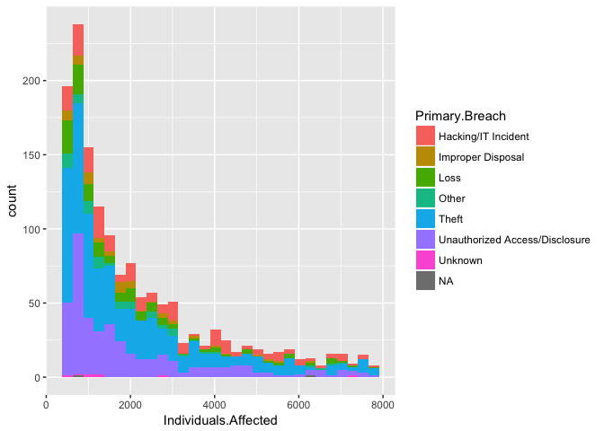
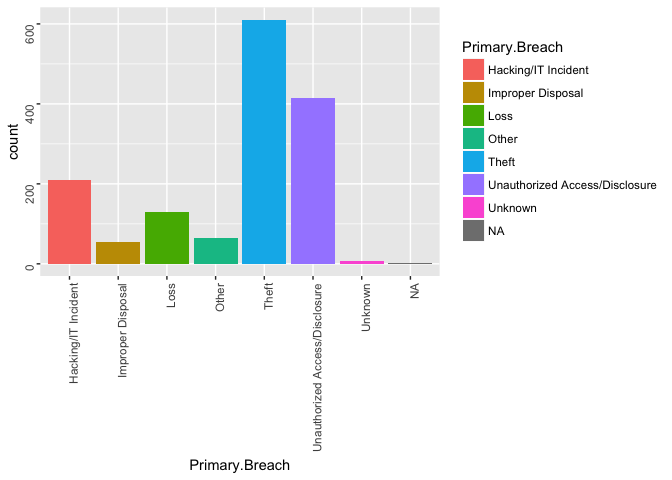
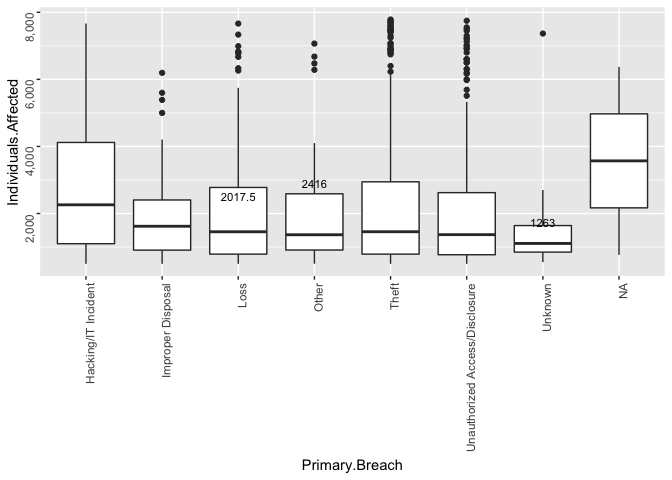
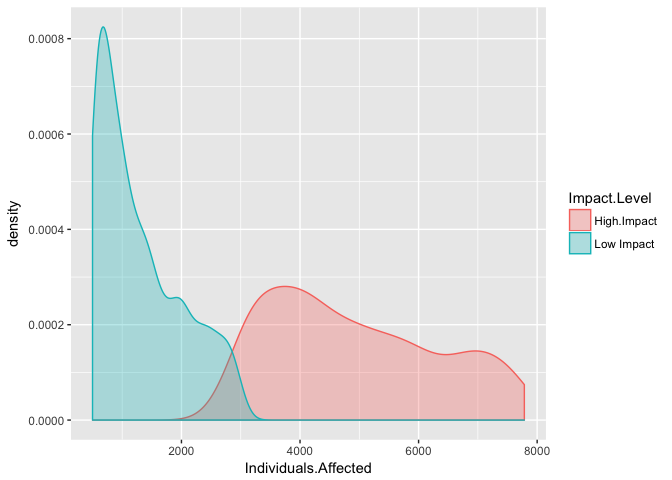
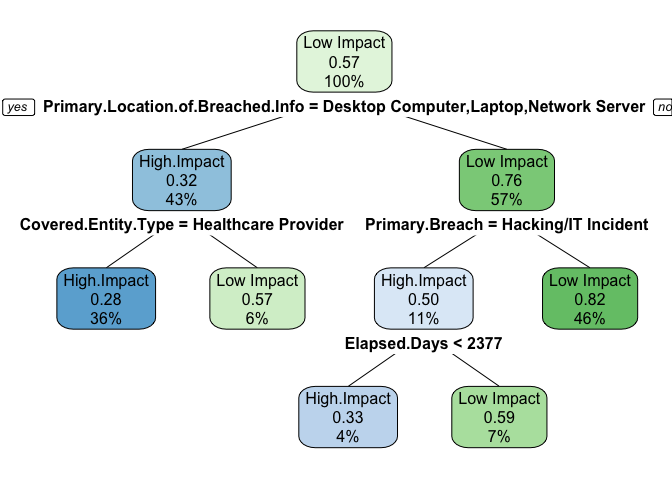
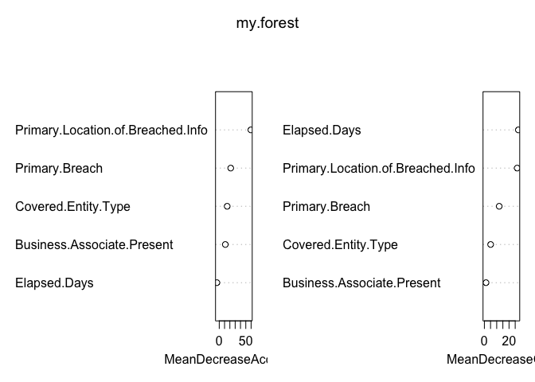

2017-12-24

Analysis of Data Breaches of HIPAA Covered Entities (CE)
--------------------------------------------------------

The Board of Directors at a regional health care provider has concerns over their potential exposure to a data breach leading to loss of patient information. They asked a cyber security company I contract for to review publicly available data to determine what, if any, commonality there is among different data breaches. If there are areas where it would make sense to focus, the organization’s IT security team will dig deeper in an effort to mitigate their risk and exposure. Organizations covered under Health Insurance Portability and Accountability Act (HIPAA) are required under the HIPAA Breach Notification to “provide notification following a breach of unsecured protected health information” (HIPAA, 2017). Information regarding these breaches is collected and available at the Office of Civil Rights portal at www.hhs.gov. Using this site, I collected data for ten years of data breaches.

Mechanics
---------

Loaded libraries used in the project

``` r
options(warn=-1)
library(readr)
library(tidyr)
library(dplyr)
library(ggplot2)
library(lubridate)
library(rpart)
library(rpart.plot)
library(randomForest)
library(caret)
library(e1071)
```

Read in the data from download and a view of how the data initially appears:

``` r
 breach_report <- read.csv("~/Downloads/breach_report.csv")
glimpse(breach_report)
```

    ## Observations: 2,046
    ## Variables: 9
    ## $ Name.of.Covered.Entity           <fctr> Aetna Inc., Medical Oncology...
    ## $ State                            <fctr> CT, DE, NY, MI, CA, TX, TX, ...
    ## $ Covered.Entity.Type              <fctr> Health Plan, Healthcare Prov...
    ## $ Individuals.Affected             <int> 11887, 19203, 744, 106008, 66...
    ## $ Breach.Submission.Date           <fctr> 8/29/2017, 8/29/2017, 8/25/2...
    ## $ Type.of.Breach                   <fctr> Unauthorized Access/Disclosu...
    ## $ Location.of.Breached.Information <fctr> Paper/Films, Desktop Compute...
    ## $ Business.Associate.Present       <fctr> No, No, No, No, No, No, No, ...
    ## $ Web.Description                  <fctr> , , , , , , , , , , , , , , ...

List of initial variables
=========================

-   Name.of.Covered.Entity: Name of Organization
-   State: US State or Territory where breach occurred
-   Covered.Entity.Type: Identifies if organization is a Health Plan,Healthcare Provider, Business Associate, Healthcare Clearing House
-   Individuals.Affected: Number of Individuals Affected by the breach
-   Breach Submission Date: Date the breach was submitted to the Office of Civil Rights
-   Type.of.Breach: Identifies how the breach occurred (Hacking, Theft, etc.)
-   Location of Breached Info: Where the data was located (laptop, paper records, etc)
-   Business.Associate.Present: Whether an associate was present at the time of the breach
-   Web Description: Narrative describing what happened

Review and Clean Data
---------------------

There were a number of items I edited to better suit my process:

1.  I removed the web description variable. It has a lot of verbiage that isn’t relevant to this project.
2.  When I looked at the “State” column, I noticed there were 53 unique entries. I would have expected there to be 50. In researching further, I noticed the District of Columbia (DC) and Puerto Rico (PR) were also included as were NA variables. I noticed the NA values appeared to be PR so I updated NA to PR. I also renamed the States column to US States and Territories to be more clear except i think it’s actually State.Territory-confirm
3.  Reviewed the columns to identify blank or NA values and replaced with “unknown” or similar
4.  I converted the date column from a character format to a date format m/d/y

``` r
breach_report$Web.Description<-NULL
unique(breach_report$State)
breach_report %>% filter(State=="DC") %>% slice(1:5)
breach_report %>% filter(is.na(State)) %>% slice(1:5)
breach_report %>% filter(State=="PR") %>% slice(1:5)
breach_report<- rename(breach_report, State.Territory = State)
breach_report$State.Territory[is.na(breach_report$State.Territory)]<-"PR"
```

``` r
# continue to review and clean as needed.  review each column or blank or NA values
# check to see if there are any blank values 
# i don't think there is a lot of value in displaying the output
breach_report %>% filter(`Type.of.Breach`=="") %>% filter(`Name.of.Covered.Entity`=="") %>% filter(`Individuals.Affected`=="") %>% filter(`Location.of.Breached.Information`=="") %>% filter(`Breach.Submission.Date`=="") %>% filter(`Business.Associate.Present`=="") %>% filter(`Covered.Entity.Type`=="") %>% filter(`Covered.Entity.Type`=="") 
```

``` r
breach_report$`Breach.Submission.Date`<- as.Date(breach_report$`Breach.Submission.Date`,"%m/%d/%Y")
head(breach_report$Breach.Submission.Date )
```

``` r
#get rid of the NAs by assigning dummy values.  for example, instead of an na value for type of breach let's make it more clear by categorizing it as unknown
breach_report %>% filter(Name.of.Covered.Entity ==""|is.na(Name.of.Covered.Entity)) %>% slice(1:5)

breach_report %>% filter(`Individuals.Affected`==""|is.na(`Individuals.Affected`)) %>% slice(1:5)

breach_report %>% filter(`Individuals.Affected`==""|is.na(`Individuals.Affected`)) %>% slice(1:5)

breach_report %>% filter(`Location.of.Breached.Information`==""|is.na(`Location.of.Breached.Information`)) %>% slice(1:5)
breach_report$`Location.of.Breached.Information`[is.na(breach_report$`Location.of.Breached Information`)]<-"unknown"
breach_report %>% filter(`Location.of.Breached.Information`==""|is.na(`Location.of.Breached.Information`)) %>% slice(1:5)
breach_report$`Type.of.Breach`[is.na(breach_report$`Type.of.Breach`)]<-"Unknown"
breach_report$`Name.of.Covered Entity`[is.na(breach_report$`Name.of.Covered.Entity`)]<-"Unknown"
breach_report$`Covered.Entity.Type`[is.na(breach_report$`Covered.Entity.Type`)]<-"Unknown"

breach_report$`Type.of.Breach`[is.na(breach_report$`Type.of.Breach`)]<-"Unknown"
breach_report$`Business.Associate.Present`[is.na(breach_report$`Business Associate Present`)]<-"Unknown"
```

Data as appears post initial clean up:

``` r
#head(breach_report,3)  #changing to glimpse to mirror first view
glimpse(breach_report)
```

    ## Observations: 2,046
    ## Variables: 9
    ## $ Name.of.Covered.Entity           <fctr> Aetna Inc., Medical Oncology...
    ## $ State.Territory                  <fctr> CT, DE, NY, MI, CA, TX, TX, ...
    ## $ Covered.Entity.Type              <fctr> Health Plan, Healthcare Prov...
    ## $ Individuals.Affected             <int> 11887, 19203, 744, 106008, 66...
    ## $ Breach.Submission.Date           <date> 2017-08-29, 2017-08-29, 2017...
    ## $ Type.of.Breach                   <fctr> Unauthorized Access/Disclosu...
    ## $ Location.of.Breached.Information <fctr> Paper/Films, Desktop Compute...
    ## $ Business.Associate.Present       <fctr> No, No, No, No, No, No, No, ...
    ## $ `Name.of.Covered Entity`         <chr> NA, NA, NA, NA, NA, NA, NA, N...

Preliminary data analysis
-------------------------

The number of individuals impacted is an area of concern for this organization. Over the ten year period examined there were 175,654,582 individuals affected over a course of course of 2046 incidents.

Please note the summary of the Individuals.Affected variable:

    Min.  1st Qu.   Median     Mean  3rd Qu.     Max.     NA's 
     500      993     2352    88446     7704 78800000       60 

The mean and median are substantially different from one another. Also, first 3 quartiles have less than 7800 (7704) individuals affected per incident. This appears to indicate that many times, the breach is not grievous; but when it is, these are quite large losses.

``` r
#distribution curve?  density plot?
sum(breach_report$Individuals.Affected,na.rm = TRUE)
summary(breach_report$Individuals.Affected)
sd(breach_report$Individuals.Affected,na.rm=TRUE)
```

At this point, I needed to do some additional cleaning. I noticed the type of breach and location of breach information provides the option for primary, secondary and tertiary sources. I used vapply to cycle through the variables and use only the primary cause.

``` r
breach_report$Primary.Breach<- vapply(strsplit(as.character(unlist(breach_report$Type.of.Breach)),",",fixed = TRUE),"[","",1)
breach_report$Primary.Location.of.Breached.Info<-vapply(strsplit(as.character(unlist(breach_report$Location.of.Breached.Information)),",",fixed = TRUE),"[","",1)
breach_report$Elapsed.Days<-as.Date(breach_report$Breach.Submission.Date)-as.Date("2009/10/21")
```

I continued to look at different areas to get a better understanding of the data

Individuals affected by year:

``` r
breach_report$Years<-year(as.Date(breach_report$Breach.Submission.Date,"%y-%m-%d"))
breach_report %>% filter(Individuals.Affected<80000000) %>% group_by(Years) %>% summarise(totals=sum(Individuals.Affected))
```

    ## # A tibble: 9 x 2
    ##   Years    totals
    ##   <dbl>     <int>
    ## 1  2009    134773
    ## 2  2010   5932276
    ## 3  2011  13150298
    ## 4  2012   2808042
    ## 5  2013   6939276
    ## 6  2014  12682073
    ## 7  2015 113267174
    ## 8  2016  16655090
    ## 9  2017   4085580

``` r
#Years<-year(as.Date(breach_report$Breach.Submission.Date,"%y-%m-%d"))
#tapply(breach_report$Individuals.Affected,Years,sum)
#this isn't right but not sure what is going wrong....the method used a few lines down does work and i can change it but would like to know why this isn't correct
```

Primary sources of the data breach:

``` r
unique(breach_report$Primary.Breach)
```

    ## [1] "Unauthorized Access/Disclosure" "Hacking/IT Incident"           
    ## [3] "Theft"                          "Loss"                          
    ## [5] "Improper Disposal"              NA                              
    ## [7] "Other"                          "Unknown"

The large numbers in the top quartile made visualization difficult. I took the data set and filtered by Individuals Affected less than 7800 to focus on the first three quartiles.

Table of Individuals Affected by Primary Breach in first three quartiles:

``` r
breach_report %>% filter(Individuals.Affected<7800) %>% group_by(Primary.Breach) %>% summarise(n_dist=n_distinct(Primary.Breach),totals=sum(Individuals.Affected))
```

    ## # A tibble: 8 x 3
    ##                   Primary.Breach n_dist  totals
    ##                            <chr>  <int>   <int>
    ## 1            Hacking/IT Incident      1  582165
    ## 2              Improper Disposal      1  103302
    ## 3                           Loss      1  278863
    ## 4                          Other      1  123382
    ## 5                          Theft      1 1338003
    ## 6 Unauthorized Access/Disclosure      1  827034
    ## 7                        Unknown      1   15690
    ## 8                           <NA>      1    7140

Table of Individuals Affected by year:

``` r
breach_report$Years<-year(as.Date(breach_report$Breach.Submission.Date,"%y-%m-%d"))
breach_report %>% filter(Individuals.Affected<7800) %>% group_by(Years) %>% summarise(n_dist=n_distinct(Primary.Breach),totals=sum(Individuals.Affected))
```

    ## # A tibble: 9 x 3
    ##   Years n_dist totals
    ##   <dbl>  <int>  <int>
    ## 1  2009      3  41773
    ## 2  2010      7 296312
    ## 3  2011      7 302706
    ## 4  2012      6 375638
    ## 5  2013      7 486016
    ## 6  2014      7 454488
    ## 7  2015      5 434268
    ## 8  2016      5 516571
    ## 9  2017      5 367807

Histogram showing the number of Individuals Affected by Primary Breach:

``` r
filter(breach_report,Individuals.Affected<7800) %>% 
ggplot(aes(Individuals.Affected, fill=Primary.Breach))+geom_histogram()
```



Bar chart of sum of incidents by Primary Breach:

``` r
breach_report %>% filter(Individuals.Affected<7800) %>% group_by(Primary.Breach) %>% #summarise( totals=sum(Individuals.Affected)) %>%  
 ggplot(aes(x=Primary.Breach,fill=Primary.Breach))+geom_bar()+theme(axis.text = element_text(angle = 90,hjust=1))
```



Boxplots of Individuals Affected by Primary Breach. Note how wide difference between the impact of many of the events versus the tails:

``` r
library(plyr)
require(scales)
p_meds<-ddply(breach_report,.(Primary.Breach),summarise,med=median(Individuals.Affected))
#ggplot(breach_report,aes(x= Primary.Breach,y=Individuals.Affected))+geom_boxplot()+geom_text(data=p_meds, aes(x=Primary.Breach,y= med, label = med),size = 3,vjust =-1.5)+scale_y_continuous(labels=comma)+theme(axis.text = element_text(angle = 90,hjust=1))

 
breach_report %>% filter(Individuals.Affected<7800) %>% ggplot(aes(x= Primary.Breach,y=Individuals.Affected))+geom_boxplot()+geom_text(data=p_meds, aes(x=Primary.Breach,y= med, label = med),size = 3,vjust =-1.5)+scale_y_continuous(labels = comma)+theme(axis.text = element_text(angle = 90,hjust=1))
```



Reviewed the preliminary data with the client with values so far. At this point, the client provided instruction to identify in what scenario the organization would be at the greatest risk for an incident that impacted a large number of individuals. With this in mind, I divided the individuals affected variable into 2 groups: High Impact with greater than 3000 Individuals Affected and Low Impact with less than 3000 impacted.

Below is a density plot of high and low impact events. As you can see, high impact events tend to concentrate a little under 4000 Individuals Affected and move out towards the tails. The low impact events are concentrated at under 1000 Individuals Affected

``` r
breach_report<-mutate(breach_report,Impact.Level=ifelse(Individuals.Affected<3000,"Low Impact","High.Impact"))
breach_report %>% filter(Individuals.Affected<7800) %>% ggplot(aes(x=Individuals.Affected))+geom_density(aes(group=Impact.Level,colour=Impact.Level,fill=Impact.Level),alpha=0.3)+scale_y_continuous(labels=comma)
```

 The challenge is to identify what factors or scenarios were likely to result in a high impact loss. Much of the data provided is categorical. For example, where the data is located, whether there was an associate present and what type of breach. As a result, working with a decision tree model seemed like a good initial approach.

I first established training and test data. I took the data from 2016 and used a random sampling method and assigned 70% of the data to a training data set. I then assigned the remaining 30% to a test data set.

``` r
#establish training data
set.seed(123)
Train.Data<- breach_report %>% filter(Years==2016)
Train.Data$Primary.Breach<-as.factor(Train.Data$Primary.Breach)
Train.Data$Impact.Level<-as.factor(Train.Data$Impact.Level)
Train.Data$Primary.Location.of.Breached.Info<- as.factor(Train.Data$Primary.Location.of.Breached.Info)

smp_size<-floor(0.70*nrow(Train.Data))


train_ind<-sample(seq_len(nrow(Train.Data)),size=smp_size)
Train<-Train.Data[train_ind,]
Test<-Train.Data[-train_ind,]
```

A decision tree model takes the training data and learns from it. It creates a set of informative partitions on likely outcomes and visually can appear like a tree. I utilized the rpart function to create a tree model and the train data to train the model. Then I used the test data to determine the accuracy of the model.

``` r
set.seed(123)
tree<-rpart(Impact.Level~Covered.Entity.Type+Elapsed.Days+Business.Associate.Present+Primary.Breach+Primary.Location.of.Breached.Info,data=Train)


#the rpart looks easier to read....need to get the date in a more useable format will need to figure out a way to make this more visible. 
#prp(tree)
rpart.plot(tree,fallen.leaves = FALSE,gap = 0)
```



The decision tree model is relatively easy to explain. Let's look at one possible path. Start at the top and identify the primary location of the data. If it's on a Desktop Computer, Electronic Medical Record or Network Server, we would progress down the left side of the tree. Then we would determine if the covered entity type is a healthcare provider. If it is not, the model would predict as a low impact and terminate. If it was a healthcare provider, it would continue to follow the path on the left.
When I first ran this model, the dates came through in a format that was very difficult to understand. To counter this, I created a new variable titled Elapsed Days. This calculates the day difference between the earliest breach submission date and the breach submission date in the incident. On the right side of the model, there is an Elapsed Days of 2377; this translates to 3/17/2016 (04/01/2009 + 2,377 days)

To determine how accurate the model is or how well it learned, I ran the trained model on the Test data and generated a confusion matrix.

``` r
PredictTree<-predict(tree,newdata=Test,type="class")
table(Test$Impact.Level,PredictTree)
```

    ##              PredictTree
    ##               High.Impact Low Impact
    ##   High.Impact          16         26
    ##   Low Impact           16         41

The confusion matrix identifies how many times the model was correct. That is, it correctly identified High Impact events 30 times and Low Impact events 33 times for a total of 63 correct predictions. It was incorrectly predicted Low Impact that were actually high impact 16 times and High Impact that were actually Low Impact 20 times. Its accuracy then, is 63/99 or about 63.64%

To see if I could improve on the results, I utilized a random forest model. This takes a similar approach as the first decision tree but it generates a determined number and plants a “forest” of decision trees.

The random forest model takes the same type of approach as the decision tree model but instead of 1 tree it plants a determined number of trees and averages out the best results. I did some testing to see what number of trees gave the most accurate forest. I found 2000 trees to be the optimal number.

``` r
set.seed(1234)
my.forest<- randomForest(as.factor(Impact.Level)~Covered.Entity.Type+Elapsed.Days+Business.Associate.Present+Primary.Breach+Primary.Location.of.Breached.Info,data=Train,importance=TRUE,ntree=2000)
#not getting the tree......in researching and reviewing it seems to create more confusion than help any...thinking I explained the tree concept above in an easier to follow tree, this one is way more complicated and the point of the forest is an ensemble approach
#getTree(my.forest)
#maybe break these out similar to how I had the initial review of data broken out and discussed/itemized....will walk through the output w more detail instead of skipping right to the confusion matrix

#print(my.forest)
```

Following plot demonstrates the relative importance of the variables in making the predictions:

``` r
varImpPlot(my.forest)
```



``` r
#print(my_solution,10)
#table(my_solution$Impact.Level,my_prediction)
```

Below is a barplot indicating the impact level relative to where the breach was located:

``` r
ggplot(Train,aes(x=Primary.Location.of.Breached.Info, fill=Impact.Level))+geom_bar()+theme(axis.text = element_text(angle = 90,hjust=1))
```


``` r
my_prediction<-predict(my.forest,Test)

table(my_prediction,Test$Impact.Level)
```

    ##              
    ## my_prediction High.Impact Low Impact
    ##   High.Impact          21         17
    ##   Low Impact           21         40

``` r
#this is how we did it on the call but the above makes more sense to me
#my_solution2<-data.frame(cbind(my_prediction,Test$Impact.Level))
#table(my_solution2)
```

Using the same training and test date, the confusion matrix indicates the model is correct 61 out of 99 incidents; or 61.62%. This is a very similar accuracy compared to the initial machine learning approach of the single decision tree accuracy.

Conclusions:
------------

So, what can be done with this information? One immediate deliverable is we’re able to identify series of events likely to lead to large numbers of individuals affected. This helps give the organization a series of events it should be aware would be likely to lead to a data breach impacting a large group of individuals. While some of these are fairly self evident (data breaches of network drives is a bad thing) perhaps the item to do differently would be to disrupt the chain of events leading to a high impact and divert to a low impact. It also suggests areas that may be more worthy of resources than others.

Another potential practical application would be in the immediate aftermath of a breach where the scope may not yet be known. Inputting the variables from the model can give vested parties (investigators, executives, security experts, government agencies) a good indicator of range of impact as it relates to people.

Finally, this could potentially be used to help set and justify cyber security insurance rates. That is, where data is located and the controls around that data relative to these variables can provide an indicator of range of impact given an event.

Next steps
----------

What is next for this project? I’d like to make this a more interactive model. My next step will be to use shiny r to generate an interactive interface. I'd like to have this constructed as a slider input where the end user can select different inputs to create their own scenario. I will explore whether this should be integrated with my client’s existing risk management platform.
